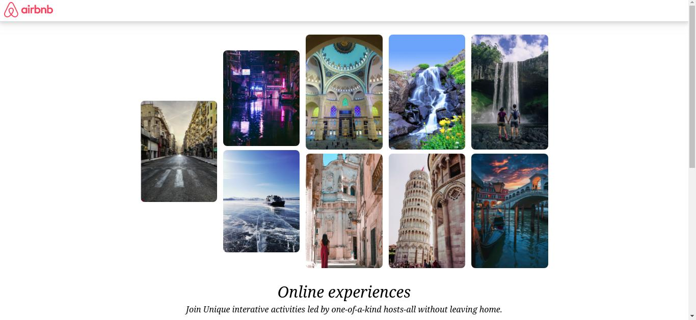
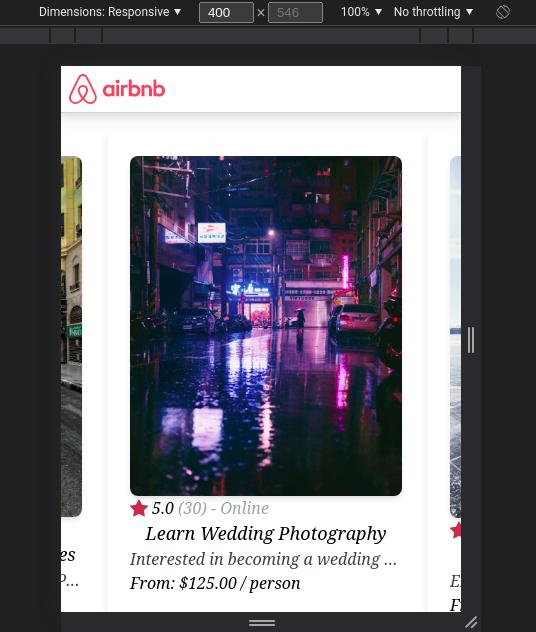

# A simplified version of the airbnb experiences built with react and node
other technologies used include tailwindCSS and Yarn

## What's the objective of this project?
- Simply to train my skills in reactJS, building UIs inspired on existing websites
- Learn the basics of front-end web development 
- And attest my development skills

## Who is it for?
To any one that wants to clone this repo and develop further the project, fell free to do so. However I won't be accepting push requests given that it's a personal project for training.

## Licence
[MIT](https://opensource.org/licenses/MIT)